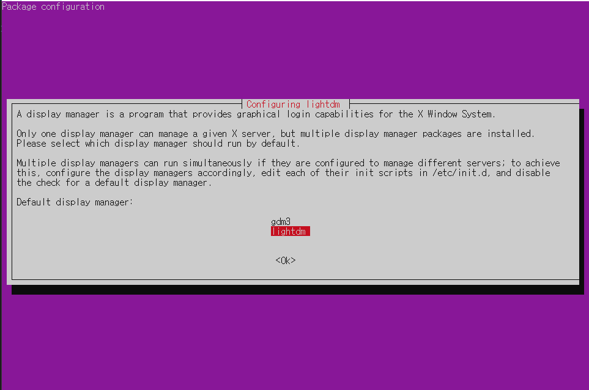
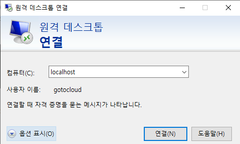
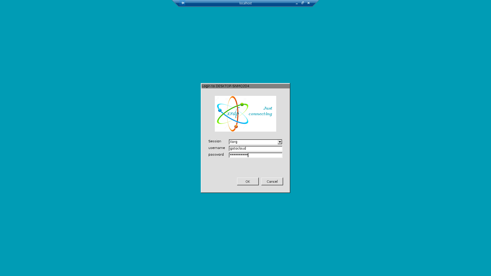
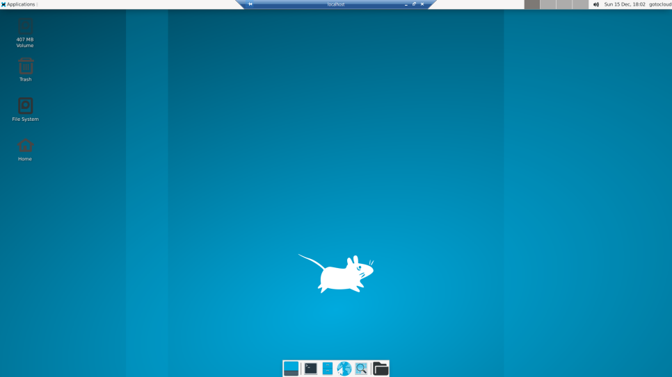
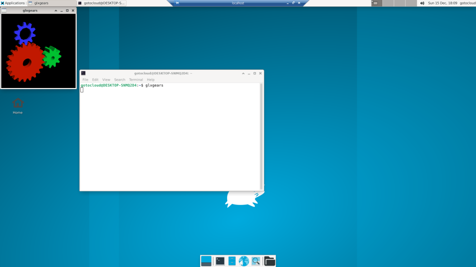
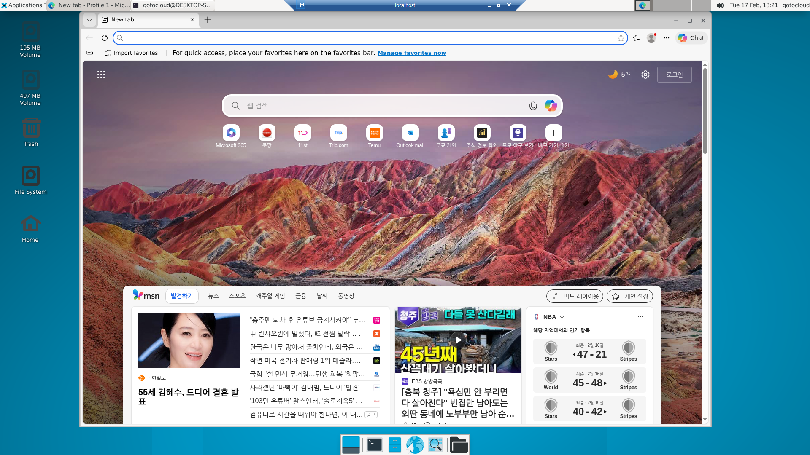
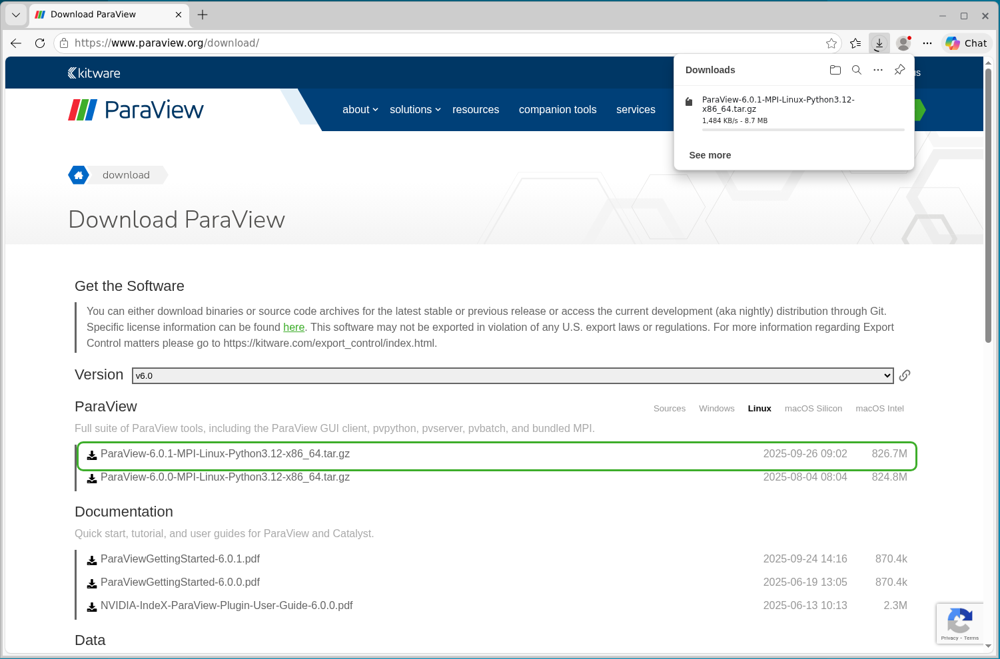
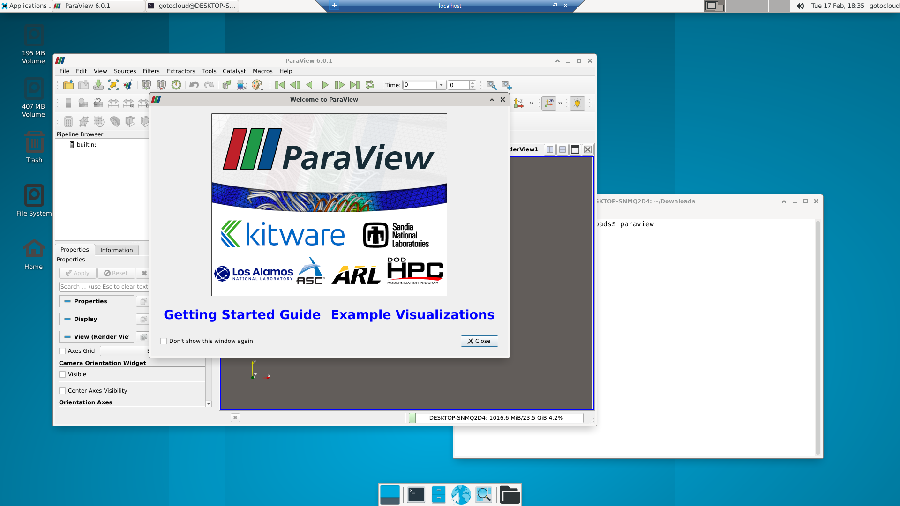

# Setting up WSL Ubuntu Linux with Remote Desktop (GUI)
This guide provides a comprehensive walkthrough for installing Ubuntu on Windows via the Windows Subsystem for Linux (WSL), configuring a Graphical User Interface (GUI) for remote access, and managing images for easy reuse through export and import functions.

## 1. Overview of WSL

**Windows Subsystem for Linux (WSL)** allows developers to run a GNU/Linux environment directly on Windows without the overhead of a traditional virtual machine or a dual-boot setup. It is an ideal solution for running Linux-specific software and development tools seamlessly alongside Windows applications.

## 2.Installing Ubunt Linux on WSL

#### Step 1: Check Available Distributions

Open the Windows Command Prompt (CMD) or PowerShell and check the list of available Linux distributions using the following command:

```
C:\Users\gotocloud> wsl --list --online

다음은 설치할 수 있는 유효한 배포 목록입니다.
'wsl.exe --install <Distro>'을 사용하여 설치합니다.

NAME                            FRIENDLY NAME
Ubuntu                          Ubuntu
Ubuntu-24.04                    Ubuntu 24.04 LTS
openSUSE-Tumbleweed             openSUSE Tumbleweed
openSUSE-Leap-16.0              openSUSE Leap 16.0
SUSE-Linux-Enterprise-15-SP7    SUSE Linux Enterprise 15 SP7
SUSE-Linux-Enterprise-16.0      SUSE Linux Enterprise 16.0
kali-linux                      Kali Linux Rolling
Debian                          Debian GNU/Linux
AlmaLinux-8                     AlmaLinux OS 8
AlmaLinux-9                     AlmaLinux OS 9
AlmaLinux-Kitten-10             AlmaLinux OS Kitten 10
AlmaLinux-10                    AlmaLinux OS 10
archlinux                       Arch Linux
FedoraLinux-43                  Fedora Linux 43
FedoraLinux-42                  Fedora Linux 42
eLxr                            eLxr 12.12.0.0 GNU/Linux
Ubuntu-20.04                    Ubuntu 20.04 LTS
Ubuntu-22.04                    Ubuntu 22.04 LTS
OracleLinux_7_9                 Oracle Linux 7.9
OracleLinux_8_10                Oracle Linux 8.10
OracleLinux_9_5                 Oracle Linux 9.5
openSUSE-Leap-15.6              openSUSE Leap 15.6
SUSE-Linux-Enterprise-15-SP6    SUSE Linux Enterprise 15 SP6
```

#### Step 2: Install Ubuntu 22.04

Install your preferred version (e.g., Ubuntu 22.04) with this command:

```
wsl --install Ubuntu-22.04

Ubuntu 22.04 LTS 시작하는 중...
Installing, this may take a few minutes...
```

During installation, you will be prompted to create a UNIX username and password (e.g., `gotocloud`). This account will be used later for the RDP connection. Once you see the `Installation successful!` message, press **Enter** to log in.

```
wsl --install Ubuntu-22.04

Ubuntu 22.04 LTS 시작하는 중...
Installing, this may take a few minutes...
wsl: Failed to start the systemd user session for 'root'. See journalctl for more details.
Please create a default UNIX user account. The username does not need to match your Windows username.
For more information visit: https://aka.ms/wslusers
Enter new UNIX username: gotocloud
New password:
Retype new password:
passwd: password updated successfully
Installation successful!
```
When the `Installation successful!` message is shown, press `Enter` key to login to the WSL linux. Linux prompt like `gotocloud@DESKTOP-SNMQ2D4:~$` appears.
```
wsl: Failed to start the systemd user session for 'gotocloud'. See journalctl for more details.
To run a command as administrator (user "root"), use "sudo <command>".
See "man sudo_root" for details.

Welcome to Ubuntu 22.04.5 LTS (GNU/Linux 6.6.87.2-microsoft-standard-WSL2 x86_64)

 * Documentation:  https://help.ubuntu.com
 * Management:     https://landscape.canonical.com
 * Support:        https://ubuntu.com/pro

 System information as of Mon Jan  6 21:37:50 UTC 2025

  System load:    1.46      Processes:             28
  Usage of /home: unknown   Users logged in:       0
  Memory usage:   5%        IPv4 address for eth0: 10.10.10.2
  Swap usage:     0%


This message is shown once a day. To disable it please create the
/home/gotocloud/.hushlogin file.

gotocloud@DESKTOP-SNMVXc7:~$
```
#### Step 3: Update OS and Install Base Packages

Once logged into the Ubuntu terminal, update the system and install essential development tools:

```
sudo apt-get update && sudo apt-get upgrade -y
sudo apt-get install -y vim nano net-tools iputils-ping build-essential cmake
```

## 3. Configure GUI desktop in WSL

#### Step 1: Install [Xfce](https://www.xfce.org/) Desktop Environment

Install **Xfce Desktop Environment**. We use Xfce because it is lightweight and specifically supported by the `xrdp` remote desktop server.

```
sudo apt install -y --no-install-recommends ubuntu-desktop xfce4 lightdm 
```

**Note:** When prompted to choose a display manager, select lightdm.



#### Step 2: Install and Verify [xrdp](https://www.xrdp.org/)

Install the Remote Desktop Protocol (RDP) server:

```
sudo apt install -y xrdp
```

After install xrdp, verify that the `xrdp` service is active:

```
sudo systemctl status xrdp

● xrdp.service - xrdp daemon
     Loaded: loaded (/lib/systemd/system/xrdp.service; enabled; vendor preset: enabled)
     Active: active (running) since Tue 2026-02-17 12:45:56 KST; 15s ago
       Docs: man:xrdp(8)
             man:xrdp.ini(5)
    Process: 1163 ExecStartPre=/bin/sh /usr/share/xrdp/socksetup (code=exited, status=0/SUCCESS)
    Process: 1171 ExecStart=/usr/sbin/xrdp $XRDP_OPTIONS (code=exited, status=0/SUCCESS)
   Main PID: 1172 (xrdp)
      Tasks: 1 (limit: 28826)
     Memory: 1004.0K
        CPU: 23ms
     CGroup: /system.slice/xrdp.service
             └─1172 /usr/sbin/xrdp

Feb 17 12:45:55 DESKTOP-SNMQ2D4 systemd[1]: Starting xrdp daemon...
Feb 17 12:45:55 DESKTOP-SNMQ2D4 xrdp[1171]: [INFO ] address [0.0.0.0] port [3389] mode 1
Feb 17 12:45:55 DESKTOP-SNMQ2D4 xrdp[1171]: [INFO ] listening to port 3389 on 0.0.0.0
Feb 17 12:45:55 DESKTOP-SNMQ2D4 xrdp[1171]: [INFO ] xrdp_listen_pp done
Feb 17 12:45:55 DESKTOP-SNMQ2D4 systemd[1]: xrdp.service: Can't open PID file /run/xrdp/xrdp.pid (yet?) after start: Op>
Feb 17 12:45:56 DESKTOP-SNMQ2D4 systemd[1]: Started xrdp daemon.
Feb 17 12:45:57 DESKTOP-SNMQ2D4 xrdp[1172]: [INFO ] starting xrdp with pid 1172
Feb 17 12:45:57 DESKTOP-SNMQ2D4 xrdp[1172]: [INFO ] address [0.0.0.0] port [3389] mode 1
Feb 17 12:45:57 DESKTOP-SNMQ2D4 xrdp[1172]: [INFO ] listening to port 3389 on 0.0.0.0
Feb 17 12:45:57 DESKTOP-SNMQ2D4 xrdp[1172]: [INFO ] xrdp_listen_pp done
```

#### Step 3: Configure Xfce4 Sessions

Configure the system so that Xfce4 starts automatically for all users upon login:

```
sudo sh -c 'echo xfce4-session > /etc/skel/.xsession'
echo xfce4-session > ~/.xsession
```

#### Step 4: Connect via RDP
Sometimes `xrdp` fails to start correctly if WSL is launched as a standard user. To ensure a stable connection, shut down WSL and restart it as the root user from your Windows command prompt:

```
wsl --shutdown
wsl -d Ubuntu-22.04 -u root
```

Now, open the **Windows Remote Desktop Connection** client and connect to `localhost`. Use the UNIX credentials you created in Section 2 to log in.



Login to the WSL with the user id and password.



Successfully connected, Linux GUI desktop is shown:


## 4. Installing Utilities
Install the necessary utilities required for CFD (Computational Fluid Dynamics) simulations.

#### Step 1: Install OpenGL Libraries 
First, install the libraries required for 3D graphical environments. Run the following command in your Ubuntu terminal, then verify the installation using `glxgears` to ensure 3D acceleration is working:

```
sudo apt -y install mesa-utils
glxgears
```


#### Step 2: Install browser
By default, there is no web browser in Xfce4 desktop environment. Install [microsoft-edge](https://customer.acecloudhosting.com/index.php/knowledgebase/194/How-to-Install-Microsoft-Edge-Browser-on-Ubuntu-22.04.html) and Korean fonts

```
sudo apt-get -y update
sudo apt-get -y upgrade
sudo apt install software-properties-common apt-transport-https wget
wget -q https://packages.microsoft.com/keys/microsoft.asc -O- | sudo apt-key add -
sudo add-apt-repository "deb [arch=amd64] https://packages.microsoft.com/repos/edge stable main"
sudo apt-get -y update
sudo apt -y install microsoft-edge-stable
```

Install Korean fonts
```
sudo apt install -y language-pack-ko fonts-nanum-* fontconfig
sudo fc-cache -f -v
```
Verify the installation
```
microsoft-edge --version
```

When you launch the browser, Ubuntu often asks to "Unlock Login Keyring". You can suppress this by deleting the existing local keyring:

```
sudo apt-get -y purge gnome-keyring
rm -rf .local/share/keyrings/
```

By removing this file, the system will no longer prompt you for a keyring password the next time you start your WSL session.

Execute the microsoft-edge browser
```
microsoft-edge
```


#### Step 3: Install Paraview

To ensure you have the latest features for data visualization, do not use `apt` to install ParaView, as the repository versions are often outdated.
Instead, download the latest version directly from the official [ParaView download page](https://www.paraview.org/download/).



**Install prerequsite packages**

```
sudo apt install -y  qtbase5-dev
sudo apt-get install -y '^libxcb.*-dev' libx11-xcb-dev libglu1-mesa-dev libxrender-dev libxi-dev libxkbcommon-dev libxkbcommon-x11-dev texinfo
```

Once you have downloaded the .tar.gz archive from the official website and follow these steps:


** Create the Installation Directory**
  
It is best practice to install manually managed software under /opt. Use the following commands to create the directory and extract the archive:

```
# Create the directory
sudo mkdir -p /opt/paraview

# Extract the downloaded archive (replace 'ParaView-x.x.x.tar.gz' with your filename)
sudo tar -xzvf ParaView-x.x.x-MPI-Linux-Python3.10-x86_64.tar.gz -C /opt/paraview --strip-components=1
```

**Configure the System-Wide PATH**

To ensure all users can run ParaView by simply typing paraview in the terminal, add the binary directory to the system-wide bash configuration file:

```
# Append the export command to /etc/bash.bashrc
sudo sh -c 'echo "export PATH=\$PATH:/opt/paraview/bin" >> /etc/bash.bashrc'

# Apply the changes to your current session
source /etc/bash.bashrc
```

**Verify the Installation**
You can now check if ParaView is correctly recognized by the system:

```
which paraview

paraview --version
```

**Execute paraview in WSL desktop**
```
paraview
```


## 5. Exporting and Managing WSL Images for Reuse
To avoid the repetitive task of re-configuring your environment, you can export your fully set up distribution. This allows you to create a portable base image that includes all your installed packages and development tools. This image can be backed up, moved to another computer, or shared with others.

#### Step 1: Exporting the Distribution
Before exporting, you must stop the running WSL instance. The following commands will shut down the distribution and export it as a .vhdx file named `Ubuntu22.04-base.vhdx`. Execute following commands in the command prompt.

```
wsl --shutdown
wsl --terminate Ubuntu-22.04
wsl --export Ubuntu-22.04 Ubuntu22.04-base.vhdx --vhd
```

**Note:** The export process may take several minutes. Once finished, you will see a file of several gigabytes in your directory.

#### Step 2: Unregistering a Distribution
If you need to remove an existing distribution to free up space or perform a clean reinstall, use the `--unregister` command:
```
wsl --unregister Ubuntu-22.04
```
*Be careful: Unregistering a distribution deletes all data associated with that instance.*

## 6. Importing a WSL Distribution
You can create a new, independent WSL instance from your exported .vhdx file.

#### Step 1: Import the image
In this example, we create a new distribution named `MyUbuntu-22.04`. The . in the command specifies the current directory as the location where the virtual disk (`ext4.vhdx`) will be stored. Execute following command in the command prompt:

```
wsl --import MyUbuntu-22.04 . Ubuntu22.04-base.vhdx --vhd
```
**Tip**: If you plan to create multiple distributions, ensure you store the ext4.vhdx file for each one in a separate directory.