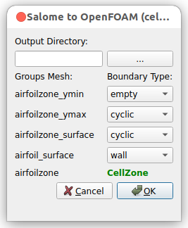

# salomeToOpenFOAM_GUI
A python script that outputs a Salome mesh to OpenFOAM written by [Nicolas Edh](https://github.com/nicolasedh)
Based on the original code, some modifications are applied

### 1.Data Processing (cellZone Support)
A new logic has been implemented within the exportToFoam function 
to identify SMESH.VOLUME types.  It automatically maps the Salome volume IDs 
to OpenFOAM cell IDs and records them in a dedicated cellZones file.

### 2.User Interface (Group Differentiation)
The GUI has been upgraded to distinguish between group types. 
Instead of listing all groups in generic combo boxes, it now allows boundary 
type configuration for FACE groups while visually labeling VOLUME groups 
as "CellZones" to prevent user error.

### 3.Real-time Feedback: 
A status update feature was added to the run() function. 
The GUI now displays a "Writing mesh files..." message immediately upon execution, 
providing better visual confirmation of the export progress.

To run just select the mesh you wish to export and go to file->load script and run `salomeToOpenFOAM_GUI.py`

