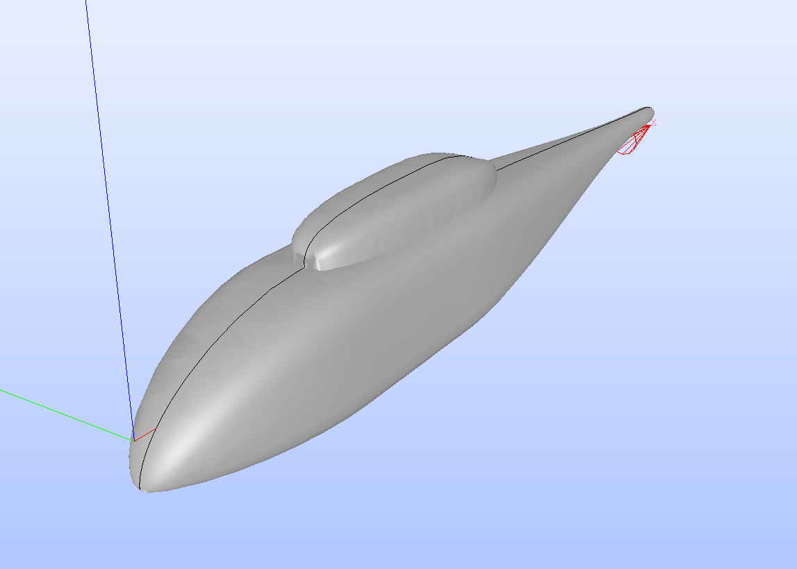

## stepROBIN: NASA ROBIN Geometry Generator for STEP format

This document describes `stepROBIN.py`, a Python utility designed to generate the **NASA ROBIN (Rotor Body Interaction)** fuselage and pylon geometry in **STEP format (.step)**.

This script is a modified version of the original genROBIN.py from the [genROBIN](https://github.com/cibinjoseph/genROBIN) project by Cibin Joseph. While the original tool focuses on generating mesh and point-cloud formats (such as CSV, STL, and VTU), this version utilizes **OpenCASCADE (via pythonocc)** to generate high-fidelity B-Spline surfaces. This modification is specifically intended to facilitate robust boolean operations and high-quality meshing in **SALOME** and other CAD-based CFD pre-processors.

### Overview
The **ROBIN (Rotor Body Interaction)** configuration is a generic helicopter fuselage used extensively in aerodynamic research to study the interaction between a main rotor and a fuselage.

The geometry is defined using a series of super-ellipse equations where the cross-sectional parameters (height, width, vertical offset, and power $N$) vary along the longitudinal axis ($x$). The `stepROBIN.py` script automates the generation of these coordinates and lofts them into formal CAD surfaces.

#### Advantages of STEP Files for CFD Workflows

- **Robust Boolean Operations** : Unlike STL meshes, which often fail during complex geometry edits, STEP files use mathematically defined surfaces. This ensures stable and "clean" operations when using **SALOME**’s 'Partition' or 'Fuse' tools to join the pylon and fuselage.

- **High-Quality Boundary Layer Meshing** : Because the geometry is represented as smooth B-Spline surfaces rather than discrete triangles, pre-processors can generate much higher-quality inflation layers and structured grids near the wall.

- **CAD Interoperability** : The generated STEP files are compatible with all major CAD and CAE software, including Ansys SpaceClaim, FreeCAD, and CATIA, allowing for further geometric modifications if necessary.

### Usage

#### Prerequisites
To run the script, you will need Python 3 along with numpy and pythonocc-core. The easiest way to set up the environment is via Conda:
```
conda install -c conda-forge numpy pythonocc-core meshio
```

#### Running the Script
The script requires four positional arguments specifying the resolution of the fuselage and the pylon:
```
python3 stepROBIN.py <nxFuselage> <ntFuselage> <nxPylon> <ntPylon>
```
- `nx`: Number of longitudinal sections.
- `nt`: Number of points around the circumference.

#### Example:
To generate the geometry with a $100 \times 100$ grid for the fuselage and $50 \times 50$ for the pylon:
```
python3 stepROBIN.py 100 100 50 50
```

#### Output
The script produces two files in the working directory:
- `robin_fuselage.step`: The main body of the helicopter.
- `robin_pylon.step`: The main body of the helicopter.



### Reference
The geometry implementation follows the analytical definitions provided in the primary NASA technical documentation:
- **Freeman, C. and Mineck, R. E.**, *"Fuselage Surface Pressure Measurements of a Generic Helicopter Model in the Presence of a 3.15-Meter Diameter Rectangular Planform Rotor,"* **NASA Technical Paper 3217, 1992**.

#### Acknowledgement
This script is based on the [genROBIN](https://github.com/cibinjoseph/genROBIN) tool. We acknowledge the work of **Cibin Joseph** for the core geometric logic. This modified version extends the original functionality by adding **STEP export** capability to support professional CFD meshing and CAD integration.
